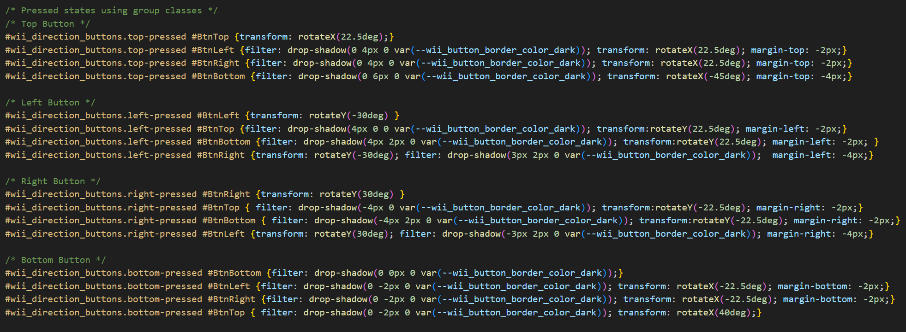
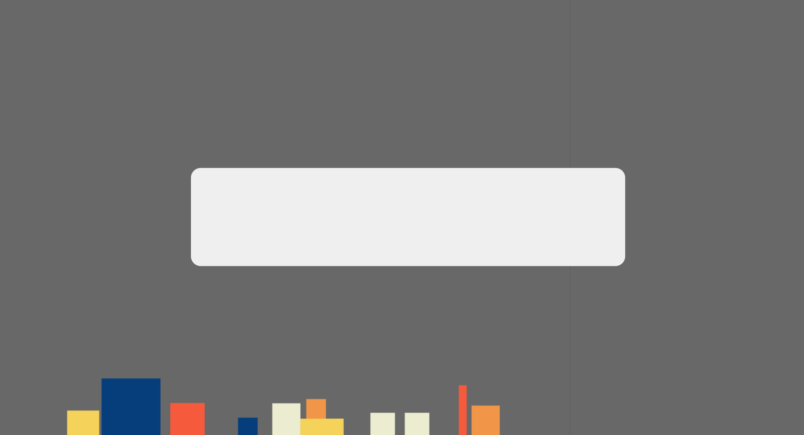

# Melvin-Web_Sprint0
Persoonlijke website

# Melvin Web Design & Development Sprint 0


## Week 1

### Maandag 2 februari 
Vrij

### Dinsdag 3 februari
Vandaag hadden we de eerste introductie van de minor, door middel van een soort "ren-je-rot" spel en een kick-off presentatie. Verder heb ik bedacht aan welke leerdoelen ik wil gaan werken tijdens de minor. Hierbij wil ik vooral focus hebben op de CSS kant, daar heb ik namelijk de meeste interesse in. Ik had namelijk al aardig wat JS ervaring door Project Tech van CMD. Van mijn 3 leerdoelen heb ik er dan dus ook 2 gefocust op CSS, de derde heeft daar ook wel een beetje mee te maken. In eerste instantie had ik hier staan dat ik minder gebruikt wilde maken van Divs in mijn HTML code. Maar deze kunnen wel gebruikt worden voor visuele elementen. Dus mijn leerdoelen worden

- Leerdoel 1: Ik wil mezelf verbeteren in het maken van animaties door gebruik van CSS zodat ik mijn website er interactiever en leuker uit kan laten zien.
- Leerdoel 2: Ik wil mijn website correct responsive maken door gebruik van de juiste styling in CSS en waar mogelijk zonder media queries zodat mijn website er op alle schermen goed uit blijft zien.
- Leerdoel 3: Ik wil alleen gebruik van maken divs in mijn html als dat nodig is voor visuele elementen zodat mijn websites beter werken voor screenreaders.

Voor de rest heb ik een idee bedacht voor mijn persoonlijke website. Ik wil laten zien dat ik veel met games doe, en het liefst ook met verschillende soorten games. Het leek me dus leuk om iets te doen met verschillende controllers. Ik wist alleen even niet hoe ik dat dan goed responsive ging krijgen. Dit heb ik met Vasilis overlegd en kwamen samen tot een idee. Sommige controllers zoals die van de Wii is redelijk verticaal, dus die kan ik goed gebruiken voor een mobiel formaat. Maar een controller zoals die van de Playstation zijn weer meer horizontaal, dus die kan ik beter gebruiker voor Desktop. Over het algemeneen heeft elke controller wel verschillende knoppen voor richting, dus die knoppen kan ik makkelijk gebruiken om consistent te houden. Iets anders wat handig is met dit idee is dat je makkelijk themes kan toevoegen in de vorm van de kleuren van de controller aan te passen.

### Woensdag 4 februari
Vandaag was ik wat eerder op school dus was ik alvast begonnen met wat dingen maken in HTML en CSS, daarna hadden we een workshop over Directus -> Fetch -> JJSON -> HTML. Hier had ik beetje ervaring mee, maar het was wel weer even een goede reminder van hoe alles ook al weer werkt. De rest van de dag ben ik verder gaan werken aan mijn wii controller voor mijn website. Hier heb ik vooral veel CSS voor geschreven. Ik heb nieuwe CSS technieken gebruikt in de vorm van specifeke selectors zoals #wii_center_buttons>p, #wii_center_buttons section>i. Maar heb ook geoefend en geleerd over dingen zoals filer: dropshadow, het stylen van hr elementen. Ik kwam ook nog op een nieuwe functie voor de on/off button. Ik leerde namelijk dat je vrij simpel een tablad kan sluiten mijn window.close() in javascript. Einde van de dag hadden we gast college van Killian Valkhof, het interessantste vond ik het gedeelte over modals, dat kan ik namelijk misschien gaan gebruiken voor mijn eigen website.

Morgen wil ik dan dus gaan werken aan de laatste puntjes op de i voor de wii controller, ik wil hem helemaal afmaken qua styling en thema's toevoegen, als ik tijd over heb wil ik al gaan werken aan de stukken tekst/illustraties voor mijn leerdoelen.

#### Bekeken websites van vandaag:
https://www.w3schools.com/cssref/css_pr_aspect-ratio.php
https://www.w3schools.com/cssref/css3_pr_justify-content.php
https://developer.mozilla.org/en-US/docs/Web/CSS/Reference/Values/filter-function/drop-shadow
https://stackoverflow.com/questions/47601564/equal-width-columns-in-css-grid
https://www.w3schools.com/css/css_align.asp
https://developer.mozilla.org/en-US/docs/Web/API/Window/close
https://www.w3schools.com/css/css_grid_container.asp
https://stackoverflow.com/questions/4151743/how-can-i-change-the-thickness-of-my-hr-tag
https://developer.mozilla.org/en-US/docs/Web/CSS/Reference/Selectors/:not

#### AI:
Gevraagd of hij de volgende regels korter kon maken:
```
border-top: 2px solid var(--wii_button_border_color); 
border-left: 2px solid var(--wii_button_border_color); 
border-right: 2px solid var(--wii_button_border_color);
```

Werd veranderd naar het volgende: 
<code>
border: 2px solid var(--wii_button_border_color);
border-bottom: none;
</code>

#### Daily Checkout met Dylan
Toevallig werd ik gekoppeld met de persoon die naast me zat, dus wij hadden gedurende de dag al veel overlegd en gekeken naar elkaars werk, dus kon ik niet veel uit deze checkout halen.


### Donderdag 5 februari
Begon vandaag met 2 verschillende workshops, na de korte presentatie van Vasilis en Sanne. Eerst had ik een workshop over Theming van Vasilis. Hier had ik nog niet mee gewerkt in mijn project want ik wilde wachten op die workshop. Tijdens de workshop heb ik geleerd over verschillende manieren over hoe je theming kan regelen op je website. Ik heb na die tijd het ook op 1 van die manieren in mijn eigen project gedaan. Het duurde iets langer dan verwacht om dit werkend te krijgen, maar het waren uiteidnelijk allemaal kleine dingetjes die verkeerd gingen. Na de workshop had ik de workshop over responsiveness gevolgd van Sanne, veel dingen hiervan had ik wel eens eerder al mee gewerkt, maar het was wel een goede reminder. Want ik wel heel handig vond was de manier van werken met een grid-area. Ik weet nog niet of ik dat nodig ga hebben voor mijn persoonlijke website, maar kan ik zeker gebruiken in komende projecten. Voor mijn eigen website heb ik dus gewerkt aan theeming vandaag, was daar ongeveer een uur mee bezig. Ik heb ook mijn controller responsive gemaakt. Ik wist niet zeker of ik genoeg tijd zou hebben om een ps5 controller nog te maken voor de deadline, dus heb ik voor nu besloten om de wii controller te laten draaien en scalen zodat hij responsive is. Dit duurde ongeveer een half uurtje. Ik heb tussendoor nog wat kleine puntjes op de I gezet voor mijn website zoals: font, borders, correcte maten en selectors nesten en een sfx voor de close button. Dit duurde bij elkaar iets van 1,5 uur. Ik had helaas wat merge problemen waar ik ook een half uur mee bezig was om te fixen vandaag. Aan het einde van de dag had ik nog even aan Sanne wat feedback gevraagd over de responsiveness van mijn controller, hij vertelde dat ik ook op moest letten op de hoogte. Dus daar heb ik mijn media query toen nog op aangepast.

#### Checkout met Lisa
Geleerd over een website die makkelijk animaties laat zien en hoe de css code daarover werkt https://animista.net/. Voor de rest was het goed om te zien hoe zij pop-ups had gedaan, daar kan ik misschien ook iets mee doen. 


### Vrijdag 6 februari
Vandaag was ik eerst bezig met het maken van de pop-ups, dit duurde ongeveer een uur. Daarna ging ik bezig om de API te laten werken zodat er informatie in 1 an die pop-ups zou worden getoond. Ik kon een groot deel van de code uit de workshop van Justus overnemen. Daardoor had ik het binnen een half uurtje al werkend gekregen. Daarna heb ik gewerkt aan het compleet draaien van de controller wanneer je op de + of - knoppen double klikt. Hier had ik ook een animatie voor gebruikt van animista en had ik een sfx aan toegevoegd. Eerst was er een probleem met de scaling. Wat kwam door een probleem met een media query. Ik kon het fixen toen ik ipv alleen de controller liet draaien, de complete main liet draaien. Dit duurde ongeveer een uur. Daarna heb ik kort nog even geprobeerd te fixen dat de A knop ook het thema veranderd. Dit duurde dan ook maar max 15 minuten.

#### Feedback uit markt
De meeste feedback die ik had gekregen was van Sanne. Hij vertelde me dat het voor de pop-ups misschien handig was om te kijken naar het pop-over attribute. Dat scheelt namelijk wat JS en beetje CSS code. Daar ga ik dus sowieso naar kijken, want nu had ik het redelijk primitief gedaan met een display: none en display: block. Voor de rest had hij een voorbeeld laten zien van een SNES controller die hij had gemaakt met animatie daarbij. Daar kan ik inspiratie uit halen voor het stylen van mijn eigen controller. Daarbij werd verteld dat het wel handig is om nog een knop over te laten voor de nieuwe eis die we maandag gaan krijgen. Het laatste kleine beetje feedback was dat ik nog een favicon kon toevoegen. Daar had ik nog niet naar gekeken namelijk.

Link naar de pagina van Sanne: https://sinds1971.nl/spelenmetcss/2022-feb/stephan/index.html <br>
Link naar pagina over pop over: https://developer.mozilla.org/en-US/docs/Web/HTML/Reference/Global_attributes/popover

### Week 1 verslag
Deze week ben ik begonnen met het maken van mijn eigen persoonlijke website over mijzelf. Dit moet een soort visitekaartje voor mij zijn. Dus de persoon die mijn website bezoekt moet een goed beeld van mij hebben. Aangezien ik veel met games doe en graag en in de toekomst ook wil blijven doen moest dat uiteraard terugkomen in mijn website. Aangezien ik niet standaard 1 soort game leuk vindt, wilde ik die variatie erin terug brengen. Mijn eerste idee was iets met verschillende controllers, waarbij je dan op knoppen kon drukken om informatie over mijzelf en mijn leerdoelen te krijgen. Aan het einde van de eerste week realiseerde ik me wel dat het me niet zou lukken om echt verschillende controllers te maken, het duurde namelijk al even voordat ik tevreden was over mijn eerste controller, die van de wii. <br><br>
Hier kon ik wel meteen wat meer werken aan een van mijn leerdoelen, het goed repsonsive maken zonder gebruik van al te veel media queries. Omdat de wii controller redelijk uniek was met dat je hem verticaal, maar ook horizontaal kon vasthouden. Kon ik hier meteen op een goede creative manier mijn website responsive maken door hem te laten draaien zodra er te weinig ruimte was. Uiteraard begon ik vanuit mobiel (verticaal) formaat en liet ik hem horizontaal draaien voor tablet en desktop formaat. Ik had hier wel nog een beetje advies voor gevraagd aan Sanne. <br><br>
Tijdens het maken van mijn controller probeerde ik ook al rekening te houden met mijn tweede leerdoel, het niet alleen maar gebruiken van divs. Uiteraard gebruikte ik daarvoor niet voor ALLES een div, maar wel voor veel containers. Omdat dat handig en makkelijker was. Maar ik wilde ook proberen mijn websites nog steeds goed te laten werken voor screenreaders. Dus heb ik geprobeerd tijdens het stylen van mijn wii controller om echt alleen divs te gebruiken als het gaat om visuele onderdelen, zoals de gaten voor geluid op de controller en de lampjes onderin voor welke speler je bent. Het was soms alleen even puzzelen welk ander HTML element dan beter zou passen. <br>
Mijn derde leerdoel waar ik aan heb gewerkt is het meer willen leren over animaties. Deze had ik daarvoor namelijk nooit echt gebruikt. Tijdens de checkout met Lisa had ik geleerd over de website animista. Hier staan veel standaard animaties op. Hier heb ik dan deze week ook gebruik van gemaakt voor een paar van mijn pop-ups. Ik kwam er alleen wel achter dat deze nog niet goed responsive waren. En tijdens de markt kwam Sanne ook nog met een andere manier van pop-ups, dus moet ik nog maar even kijken of die animaties dan nog goed werken. <br><br>
Deze week heb ik verschillende dingen geleerd, zo heb ik gewerkt met animaties, heb ik geoefend en geleerd over het realisitisch namaken van objecten door middel van CSS en heb ik verschillenden dingen geleerd tijdens de workshops. De workshop over de API was vooral een goede reminder van hoe het ook al weer werkte, de workshop over theming heb ik geleerd over hoe ik gemakkelijk een light en dark thema kan maken en toevoegen aan mijn website. Enmet de workshop over responsiveness heb ik nieuwe en handige manier geleerd over het gebruik van grid-areas die ik daarvoor nog niet kende. Al met al was het dus een flink productieve week.

## Week 2

### Maandag 9 februari
Ben vandaag verder gegaan met de feedback die ik had gekregen uit de markt. Sanne had me verteld over het popover attribute. Ik heb hier naar gekeken en kon daardoor een groot deel van mijn javascript code weghalen. De pop-ups zelf werkend maken duurde 15 min. Er kwam hierdoor alleen wel een probleem met het positioneren van de popups. Omdat het nieuwe attribute het een position: fixed maakt, moest ik het centreren anders doen. Oorspronkelijk had ik het gedaan met position: absolute, maar dat werkte te hard met transform. Dit werkte weer niet vanwege mijn animaties omdat die ook transform gebruiken. Ik heb eerste de animaties uitgezet zodat ik eerst goed de positie kon regelen. Dat uitzoeken duurde ongeveer anderhalf uur. Ik ben toen eerst gaan werken aan de states van buttons. Ik wilde in ieder geval een pressed state toevoegen. Voor de A, - en + knop ging dit vrij gemakkelijk. Maar voor de D-Pad was dit een stuk moeilijker, ik probeer het eerst met een ~ selector, maar dit werkt alleen voor elementen die na het hoofdelement in de DOM komen, dus alleen de bovenste knop werkte goed. Ik heb daarna met wat hulp van ChatGPT het werkend gekregen. Ik gaf hem precies de uitleg van welke knoppen er moeten veranderen en welke op dezelfde manier veranderen. Later bleek dit toch iets anders te lopen. Maar het werkend krijgen van states van buttons duurde ongeveer 3 uur. Als laatste vandaag heb ik mijn API aangevuld en heb ik de pop up waar de informatie in staat ook wat meer ingevuld door mijn bijnaam en favoriete games toe te voegen. Dat gedeelte duurde ongeveer een uur.

#### Weggehaalde code
<code>
// =======================
// Button references
// =======================
const btnTop = document.getElementById("BtnTop");
const btnLeft = document.getElementById("BtnLeft");
const btnRight = document.getElementById("BtnRight");
const btnBottom = document.getElementById("BtnBottom");

const buttons = [btnTop, btnLeft, btnRight, btnBottom];

// =======================
// Popup references
// =======================
const popUps = [
  document.getElementById("pop-up1"),
  document.getElementById("pop-up2"),
  document.getElementById("pop-up3"),
  document.getElementById("pop-up4"),
];

let activePopup = null;

// =======================
// Helper functions
// =======================
function hideAllPopups() {
  popUps.forEach(popup => {
    if (!popup) return;

    popup.classList.remove("pop-up_active");
    popup.classList.add("pop-up_inactive");
  });

  activePopup = null;
}

function togglePopup(popup) {
  if (!popup) return;

  // Same popup → close
  if (activePopup === popup) {
    popup.classList.remove("slide-fwd-left");
    hideAllPopups();
    return;
  }

  // Close others
  hideAllPopups();

  // Show popup
  popup.classList.remove("pop-up_inactive");
  popup.classList.add("pop-up_active");

  if (popup.id === "pop-up1") {
    popup.classList.remove("slide-fwd-top"); 
    void popup.offsetWidth; 
    popup.classList.add("slide-fwd-top");
  }

  if (popup.id === "pop-up2") {
    popup.classList.remove("slide-fwd-left"); 
    void popup.offsetWidth; 
    popup.classList.add("slide-fwd-left");
  }

  if (popup.id === "pop-up3") {
    popup.classList.remove("slide-fwd-right");
    void popup.offsetWidth;
    popup.classList.add("slide-fwd-right");
  }

  if (popup.id === "pop-up4") {
    popup.classList.remove("slide-fwd-bottom");
    void popup.offsetWidth;
    popup.classList.add("slide-fwd-bottom");
  }

  activePopup = popup;
}


// =======================
// Close popup when clicking outside
// =======================
document.addEventListener("click", (e) => {
  if (!activePopup) return;

  const clickedButton = buttons.some(btn => btn?.contains(e.target));
  const clickedPopup = activePopup.contains(e.target);

  if (!clickedButton && !clickedPopup) {
    hideAllPopups();
  }
});
</code>

#### Geprobeerde code voor D-Pad states
<code>
    #BtnTop:active {
        background: yellow;
        
        ~ #BtnRight,  ~ #BtnLeft {
            background:red;
        }

        ~ #BtnBottom {
            background:green;
        }
    }

    /* Left button pressed */
    #BtnLeft:active {
        background: yellow;
        
        ~ #BtnTop, ~ #BtnBottom {
            background:red;
        }

        ~ #BtnRight {
            background:green;
        }
    }

    /* Right button pressed */
    #BtnRight:active {
        background: yellow;
        
        ~ #BtnTop, ~ #BtnBottom {
            background:red;
        }

        ~ #BtnLeft {
            background:green;
        }
    }

    /* Right button pressed */
    #BtnBottom:active {
        background: yellow;
        
        ~ #BtnLeft, ~ #BtnRight {
            background:red;
        }

        ~ #BtnTop {
            background:green;
        }
    }
</code>



#### Bekeken websites van vandaag:
https://developer.mozilla.org/en-US/docs/Web/HTML/Reference/Global_attributes/popover
https://developer.mozilla.org/en-US/docs/Web/CSS/Reference/Selectors/Pseudo-classes
https://developer.mozilla.org/en-US/docs/Web/CSS/Reference/Values/transform-function/rotateX 
https://developer.mozilla.org/en-US/docs/Web/CSS/Reference/Values/transform-function/scale

### Dinsdag 10 februari
Vandaag had ik eerst een workshop over typografie. Hier had ik de vraag naar wat basisregels voor typografie. Dus bijvoorbeeld hoeveel tekens op een regel en lettergrootte enzo. Hierin was het advies vooral om het soms een beetje aan te kijken of het er goed uitziet en eventueel dus meer line-spacing toe te voegen of de regels korter te maken. Maar dat de regel ongeveer 20 tot 40 keer de fontgrootte goed is, of 40 tot 80 tekens. Dat is het belangrijkste wat ik ervan had geleerd. Deze workshop duurde een uurtje. Daarna ging ik werken aan extra eis die we maandag kregen. Ik had hier wel ChatGPT om hulp gevraagd voor het API gedeelte. Ik had namelijk wat problemen met het inladen van de informatie op de juiste locatie. Zo had ik vooral hulp nodig in mijn standaard javascript. Want sommige ids van mensen werkten niet en had ik hulp nodig voor het randomizen van welk id je kreeg te zien. Ik wilde namelijk dat als je op de 1 of 2 klikt dat je een random id van een andere minor student krijgt en dat als je op 1 klikt dat hij 1 id naar beneden gaat en als je op 2 klikt dat hij 1 id omhoog gaat. Deze API dingen regelen duurde ongeveer 2 uur. De rest van de dag ben ik bezig geweest met een nieuwe mechanic voor mijn homebutton. Ik wilde dat als je op de button klikt dat bepaalde elementen met gravity vallen, maar dat ze nog steeds binnen het scherm liggen en dat je ermee kan spelen en dat ze nog steeds klikbaar zijn. Ik heb hier verschillende websites voor gebruikt. Uiteindelijk leerde ik over matter.js. Dit was een makkelijke manier om physics toe te voegen aan mijn website, maar ik kreeg het niet werkend zoals ik voor ogen had. Het maakte namelijk losse elementen op een canvas, maar het hield dus niet de styling die het al had. Het was flink lastig, maar misschien handig voor een ander project. Ik ben met deze homebutton mechanic 3 uur bezig geweest, maar morgen ga ik waarschijnlijk wat anders mee doen.




#### Bekeken websites
https://www.reddit.com/r/learnjavascript/comments/gp2t2h/how_to_add_gravity_to_elements/
https://brm.io/matter-js/

#### Geprobeerde code
<code>
// =======================
// Home button gravity effect
// =======================
document.addEventListener('DOMContentLoaded', () => {
    const homeBtn = document.getElementById('homeBtn');

    homeBtn.addEventListener('click', () => {
        // Prevent multiple initializations
        if (window.gravityActivated) return;
        window.gravityActivated = true;

        const { Engine, Runner, Bodies, Composite, Events } = Matter;

        // Create engine
        const engine = Engine.create();
        const world = engine.world;

        const width = window.innerWidth;
        const height = window.innerHeight;

        // Get all elements with the gravity-target class
        const gravityTargets = document.querySelectorAll('.gravity-target');

        gravityTargets.forEach(elem => {
            const rect = elem.getBoundingClientRect();

            const body = Bodies.rectangle(
                rect.left + rect.width / 2,
                rect.top + rect.height / 2,
                rect.width,
                rect.height,
                {
                    restitution: 0.5, // bounce
                    friction: 0.1,
                    frictionAir: 0.02,
                    inertia: Infinity // keeps them upright (optional)
                }
            );

            elem._matterBody = body;
            Composite.add(world, body);
        });

        // Invisible walls to keep elements inside viewport
        const thickness = 100;
        const walls = [
            Bodies.rectangle(width / 2, -thickness / 2, width, thickness, { isStatic: true }),
            Bodies.rectangle(width / 2, height + thickness / 2, width, thickness, { isStatic: true }),
            Bodies.rectangle(-thickness / 2, height / 2, thickness, height, { isStatic: true }),
            Bodies.rectangle(width + thickness / 2, height / 2, thickness, height, { isStatic: true })
        ];
        Composite.add(world, walls);

        // Run the physics engine
        const runner = Runner.create();
        Runner.run(runner, engine);

        // Move the actual HTML elements according to physics bodies
        Events.on(engine, 'afterUpdate', () => {
            gravityTargets.forEach(elem => {
                const body = elem._matterBody;
                elem.style.position = 'absolute';
                elem.style.left = `${body.position.x - body.bounds.max.x + body.bounds.min.x + (body.bounds.max.x - body.bounds.min.x)/2}px`;
                elem.style.top = `${body.position.y - body.bounds.max.y + body.bounds.min.y + (body.bounds.max.y - body.bounds.min.y)/2}px`;
                elem.style.transform = `rotate(${body.angle}rad)`; // remove this line if you want to prevent rotation
            });
        });
    });
});
</code>

#### Checkout met Sabrina
Ik had vandaag een check-out samen emt Sabrina. Zij had een soort paspoortje waar vooral veel animatie in zat. Zelf wilde ik ook meer met animatie doen dus het was leuk om te kijken wat iemand er anders er al mee had gedaan. Daar heb ik inspiratie uit kunnen nemen. Voor de rest heb ik zelf verteld over hoe ik met matter.js heb geoefend, maar het denk ik toch later niet ga gebruiken. Het werkte namelijk toch niet helemaal lekker voor mijn project. Morgen ga ik werken aan de laatste puntjes op de I en ga ik mijn homeButton nog een andere functionaliteit geven, het liefst met meer animatie. Voor de rest ga ik toch nog even kijken of het mogelijk is om mijn pop-ups te animeren. Het zou namelijk kunnen zijn dat het niet werkte door code op mijn body die overbodig was, ga ik morgen naar kijken. Morgen ga dus werken aan die animaties, ga ik een nieuwe mechaniek/animatie toevoegen aan de home knop en wil ik nog wat kleine dingetjes toevoegen. Zo zag ik bij Dylan hoe hij de favColor uit de API gebruikte om zijn speler te veranderen, ik kan waarschijnlijk hetzelfde doen met het lampje op mijn controller. Ook wilde ik kijken of ik nog een klein dingetje kon toevoegen dat je misschien niet standaard zou vinden op de website.

### Woensdag 11 februari
Vandaag was ik zoals altijd weer eerder in het lokaal. Voordat de les was begonnen kreeg ik het al voor elkaar dat de favoriete kleur van de persoon die actief is in de pop-ups, dat die kleur wordt gebruikt in het lampje op de controller. Ik moest alleen later nog toevoegen dat hij weer terug gaat naar default zodra de pop-up sluit. Dit duurde ongeveer 30 min. Daarna had ik een code review samen met Lisa. Hier kwam vooral uit dat ik mijn naam geven wat netter kon doen in kebab-case en dat mijn javascript nog veel ; had, dat duurde ongeveer een uur in totaal. Ik wilde nog even kijken naar de animatie voor de popups, aangezien ik dacht te weten hoe ik dat kon fixen. Later had ik het toch nog aan Sanne gevraagd, die raadde een website aan. Aan de hand van die website kreeg ik het gefixt om een opacity animatie te maken. Later op de dag lukte het ook nog met de scale, maar alleen bij het openen. Met hulp van Sanne kregen we daarna ook het sluiten gefixt. Heb ik geleerd over hoe je niet altijd transform hoeft te gebruiken voor translate, rotate of scale. Maar dat ze wel in die volgorde worden uitgevoerd. Het hele fixen van de animatie duurde ongeveer 2,5 uur. Hierdoor kon ik wel mijn oude animatie code weghalen. Vandaag heb ik nog een schud animatie op de home knop gezet samen met een sfx, dit duurde maar 1 uurtje. Deze animatie had ik wel compleet zelf gemaakt en niet van een voorbeeld. Ik had tijdens de typografie workshop van gister geleerd dat mijn manier van een font inladen eigenlijk niet goed was, dus vandaag had ik dat beter gedaan door hem te downloaden en mee te sturen in het project ipv hem te importeren. Dit duurde even voordat ik het werkend had, totaal iets van half uurtje. Ik had ook nog een probleem met darkmode gefixt, als je namelijk al begon in darkmode kon je niet meer in lightmode komen. Ik heb mijn media query uit mijn css gehaald zodat ik in JS kon checken in welke state je zat en aan de hand daarvan de juiste klas kon koppelen aan de button. Ik had ook nog een kleine gradient toegevoegd aan mijn background, puur zodat hij iets minder vlak is. Daar had ik een website voor gebruikt om dat te genereren. Als allerlaatste heb ik nog even een favicon toegevoegd.
<code>
@media (prefers-color-scheme:dark) {
        --wii-color: #2c3033;
        --wii-color-text: #ffffff;
        --wii-button-border-color-shadow: #1e1e1e;
}
</code>
<code>
.slide-fwd-top {
    -webkit-animation: slide-fwd-top 0.45s cubic-bezier(0.250, 0.460, 0.450, 0.940) both;
    animation: slide-fwd-top 0.45s cubic-bezier(0.250, 0.460, 0.450, 0.940) both;
}

@-webkit-keyframes slide-fwd-top {
    0% {
        -webkit-transform: translateZ(0) translateY(0) scale(0.8);
        transform: translateZ(0) translateY(0) scale(0.8);
    }

    100% {
        -webkit-transform: translateZ(160px) translateY(-100px) scale(1);
        transform: translateZ(160px) translateY(-100px) scale(1);
    }
}

@keyframes slide-fwd-top {
    0% {
        -webkit-transform: translateZ(0) translateY(0) scale(0.8);
        transform: translateZ(0) translateY(0) scale(0.8);
    }

    100% {
        -webkit-transform: translateZ(160px) translateY(-100px) scale(1);
        transform: translateZ(160px) translateY(-100px) scale(1);
    }
}

.slide-fwd-left {
    -webkit-animation: slide-fwd-left 0.45s cubic-bezier(0.250, 0.460, 0.450, 0.940) both;
    animation: slide-fwd-left 0.45s cubic-bezier(0.250, 0.460, 0.450, 0.940) both;
}

@-webkit-keyframes slide-fwd-left {
    0% {
        -webkit-transform: translateZ(0) translateX(0) scale(0.8);
        transform: translateZ(0) translateX(0) scale(0.8);
    }

    100% {
        -webkit-transform: translateZ(160px) translateX(-100px) scale(1);
        transform: translateZ(160px) translateX(-100px) scale(1);
    }
}

@keyframes slide-fwd-left {
    0% {
        -webkit-transform: translateZ(0) translateX(0) scale(0.8);
        transform: translateZ(0) translateX(0) scale(0.8);
    }

    100% {
        -webkit-transform: translateZ(160px) translateX(-100px) scale(1);
        transform: translateZ(160px) translateX(-100px) scale(1);
    }
}

.slide-fwd-right {
    -webkit-animation: slide-fwd-right 0.45s cubic-bezier(0.250, 0.460, 0.450, 0.940) both;
    animation: slide-fwd-right 0.45s cubic-bezier(0.250, 0.460, 0.450, 0.940) both;
}

@-webkit-keyframes slide-fwd-right {
    0% {
        -webkit-transform: translateZ(0) translateX(0) scale(0.8);
        transform: translateZ(0) translateX(0) scale(0.8);
    }

    100% {
        -webkit-transform: translateZ(160px) translateX(100px) scale(1);
        transform: translateZ(160px) translateX(100px) scale(1);
    }
}

@keyframes slide-fwd-right {
    0% {
        -webkit-transform: translateZ(0) translateX(0) scale(0.8);
        transform: translateZ(0) translateX(0) scale(0.8);
    }

    100% {
        -webkit-transform: translateZ(160px) translateX(100px) scale(1);
        transform: translateZ(160px) translateX(100px) scale(1);
    }
}

.slide-fwd-bottom {
    -webkit-animation: slide-fwd-bottom 0.45s cubic-bezier(0.250, 0.460, 0.450, 0.940) both;
    animation: slide-fwd-bottom 0.45s cubic-bezier(0.250, 0.460, 0.450, 0.940) both;
}

@-webkit-keyframes slide-fwd-bottom {
    0% {
        -webkit-transform: translateZ(0) translateY(0) scale(0.8);
        transform: translateZ(0) translateY(0) scale(0.8);
    }

    100% {
        -webkit-transform: translateZ(160px) translateY(100px) scale(1);
        transform: translateZ(160px) translateY(100px) scale(1);
    }
}

@keyframes slide-fwd-bottom {
    0% {
        -webkit-transform: translateZ(0) translateY(0) scale(0.8);
        transform: translateZ(0) translateY(0) scale(0.8);
    }

    100% {
        -webkit-transform: translateZ(160px) translateY(100px) scale(1);
        transform: translateZ(160px) translateY(100px) scale(1);
    }
}
</code>

#### Code review met Lisa
Uit de code review kwam vooral dat ik soms mijn naamgeving wel wat er beter kan doen, niet alleen gebruik ik niet vaak kebab-case voor mijn classes en ids, maar zijn niet alle namen allemaal even duidelijk. In mijn HTML en mijn CSS. In mijn JavaScript specifiek moet ik even consistent worden in wanneer ik wel of niet een ; ga doen.

#### Checkout met Dylan
Ik werd vandaag weer gekoppeld met Dylan, de persoon die naast me zit. Ik heb hier dus niet heel veel specifiek uit de checkout kunnen halen omdat we vaak toch al een beetje bij elkaar keken van hoe en wat de andere persoon aan het doen is. Zo had ik gedurende de dag zijn hulp bij het regelen van mijn fonts en het testen van mijn darkmode. Voor de rest van vandaag ga ik nog bronnen toevoegen aan mijn code en ga ik mijn readme afschrijven.

#### Bekeken websites
https://blog.logrocket.com/animating-dialog-popover-elements-css-starting-style/
https://cssgradient.io/

### Donderdag 12 februari
Vandaag om 10.00 is de deadline en hebben we een markt met alle websites

### Week 2 verslag
De eerste dag van de tweede week was ik thuis gebleven omdat ik me niet zo lekker voelde, maar heb ik wel nog een beetje door kunnen werken aan mijn opdracht. Zo ben ik verder gegaan met de API, hier had ik wel wat hulp van ChatGPT bij gebruikt. Ik had namelijk problemen met het inladen van de juiste informatie voor op de juiste locatie in de pop-up. Ik had nog 2 knoppen van mijn controller over waar ik nog geen functie voor had, dus had ik besloten dat ik ze allebei zou gebruiken voor de extra eis van deze week. Dat je met de 1 een id naar beneden zou gaan en met de 2 een id omhoog. Dit was alleen wat lastiger dan verwacht dus ook hier heb ik ChatGPT om hulp gevraagd. Daarna kwam ik er wel goed uit. deze week heb ik ook iets geleerd over een onderdeel wat ik later niet eens heb gebruikt in mijn eindproduct. Ik probeerde namelijk een extra dingetje voor de leuk toe te voegen dat als je op de Home Button klikt op de controller dat dan elke toets en element zou vallen in je scherm, maar nog steeds functioneel waren. Het duurde lang om te kijken hoe dit moest, maar uiteindelijk heb ik het geprobeerd met matter.js. Dit is een javascript script dat je kan inladen zodat je hem voor je website kan gebruiken< Het heeft heel veel mogelijkheden, maar het zou nu iets te laat zijn om het werkend te maken. Hier had ik dan eerder mee moeten beginnen, want nu had ik er geen tijd meer voor. Maar ik kan dit zeker later voor een andere website nog zeker wel eens gebruiken. Later heb ik van de home knop een extra animatie toegevoegd, en deze had ik 100% zelf gemaakt met CSS. Dus ook zonder voorbeeld van animista. Het was een simpele animatie, maar ben zeer tevreden over hoe hij eruit is komen te zien. Ik had nog een sound effect toegevoegd voor een beetje extra sfeer. <br><br>
Deze week had ik ook nog een workshop over typografie. Dit was niet per se allemaal nieuwe informatie, maar het was wel handig om de basisregels even een beetje door te nemen over hoeveel tekens op een regel en waar je op moet letten bij het uitzoeken van een goed leesbaar lettertype. <br><br>
De laatste woensdag was een kwestie van puntjes op de i, ik had nog een paar kleine ideetjes voor dingen waar ik iets mee zou willen. Zo heb ik de fav_color van medestudenten nog gebruikt voor mijn lampje op de controller, heb ik toegevoegd dat je met 1,2,3 en 4 het lampje kan verplaatsen. Heb ik veranderd hoe ik mijn font inlaad omdat ik tijdens de workshop had geleerd dat mijn huidige manier van importeren eigenlijk niet goed is. En heb ik toch nog even gekeken naar de animatie van de pop-ups. Deze had ik namelijk een tijdje uitstaan omdat het lastig was om het responsive te maken met mijn oude code. Maar aangezien ik voor mijn leerdoel met animaties wilde werken, keek ik er toch nog even naar. Sanna had me een website verteld waar ik goed met popover pop-ups animaties kon maken. Dit hielp veel en ik kwam ook wel ver, maar voor het laatste beetje had ik toch nog even Sanne om hulp gevraagd. Hij had nog uitleg gegeven over hoe je met transform properties zoals translate, rotate en scale, je niet per se eerst transform hoeft neer te zetten. Dit kan helpen om mijn wat meer overzicht te geven in mijn CSS. Maar het was uiteindelijk wel nog gelukt om de animaties werkend te krijgen, daar ben ik zeer tevreden mee. Voor de rest was het handig om een website te hebben waar alle standaard code conventions op staan, die kan ik meenemen naar volgende projecten zodat ik niet achteraf alles nog hoef te checken.

## Complete bronnen lijst
### Websites
https://www.w3schools.com/cssref/css_pr_aspect-ratio.php
https://www.w3schools.com/cssref/css3_pr_justify-content.php
https://developer.mozilla.org/en-US/docs/Web/CSS/Reference/Values/filter-function/drop-shadow
https://stackoverflow.com/questions/47601564/equal-width-columns-in-css-grid
https://www.w3schools.com/css/css_align.asp
https://developer.mozilla.org/en-US/docs/Web/API/Window/close
https://www.w3schools.com/css/css_grid_container.asp
https://stackoverflow.com/questions/4151743/how-can-i-change-the-thickness-of-my-hr-tag
https://developer.mozilla.org/en-US/docs/Web/CSS/Reference/Selectors/:not
https://animista.net/
https://sinds1971.nl/spelenmetcss/2022-feb/stephan/index.html
https://developer.mozilla.org/en-US/docs/Web/HTML/Reference/Global_attributes/popover
https://developer.mozilla.org/en-US/docs/Web/HTML/Reference/Global_attributes/popover
https://developer.mozilla.org/en-US/docs/Web/CSS/Reference/Selectors/Pseudo-classes
https://developer.mozilla.org/en-US/docs/Web/CSS/Reference/Values/transform-function/rotateX 
https://developer.mozilla.org/en-US/docs/Web/CSS/Reference/Values/transform-function/scale
https://www.reddit.com/r/learnjavascript/comments/gp2t2h/how_to_add_gravity_to_elements/
https://brm.io/matter-js/
https://blog.logrocket.com/animating-dialog-popover-elements-css-starting-style/
https://cssgradient.io/
ChatGPt voor sommige dingen

### Illustraties
https://images.seeklogo.com/logo-png/9/2/nintendo-wii-logo-png_seeklogo-99685.png

### Inspiratie
https://encrypted-tbn0.gstatic.com/images?q=tbn:ANd9GcTHNw2Ip8d8CU5oWvMjqvJO2AsS2SEM0ilbTA&s
https://www.retronintendokaufen.de/Files/2/40000/40305/ProductPhotos/Source/1146475106.jpg
https://www.retronintendokaufen.de/Files/2/40000/40305/ProductPhotos/Source/1674897526.jpg

### Sounds
https://www.youtube.com/shorts/Wu71oHDVmNc
https://www.youtube.com/watch?v=psc_A0bUgSQ-
https://www.youtube.com/watch?v=P1gJJqYXpTc

### Fonts
https://fonts.google.com/specimen/Jost