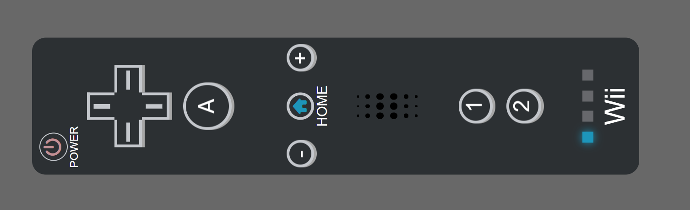
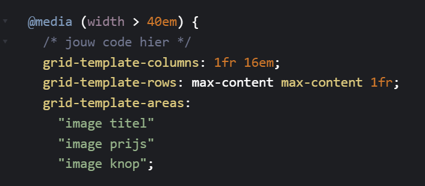

# Melvin-Web_Sprint0
Persoonlijke website

# Melvin Web Design & Development Sprint 0

## Week 1

### Maandag 2 februari 
Vrij

### Dinsdag 3 februari
Vandaag hadden we de eerste introductie van de minor, door middel van een soort "ren-je-rot" spel en een kick-off presentatie. Verder heb ik bedacht aan welke leerdoelen ik wil gaan werken tijdens de minor. Hierbij wil ik vooral focus hebben op de CSS kant, daar heb ik namelijk de meeste interesse in. Ik had namelijk al aardig wat JS ervaring door Project Tech van CMD. Van mijn 3 leerdoelen heb ik er dan dus ook 2 gefocust op CSS, de derde heeft daar ook wel een beetje mee te maken. In eerste instantie had ik hier staan dat ik minder gebruikt wilde maken van Divs in mijn HTML code. Maar deze kunnen wel gebruikt worden voor visuele elementen. Dus mijn leerdoelen worden

- Leerdoel 1: Ik wil mezelf verbeteren in het maken van animaties door gebruik van CSS zodat ik mijn website er interactiever en leuker uit kan laten zien.
- Leerdoel 2: Ik wil mijn website correct responsive maken door gebruik van de juiste styling in CSS en waar mogelijk zonder media queries zodat mijn website er op alle schermen goed uit blijft zien.
- Leerdoel 3: Ik wil alleen gebruik van maken divs in mijn html als dat nodig is voor visuele elementen zodat mijn websites beter werken voor screenreaders.

Voor de rest heb ik een idee bedacht voor mijn persoonlijke website. Ik wil laten zien dat ik veel met games doe, en het liefst ook met verschillende soorten games. Het leek me dus leuk om iets te doen met verschillende controllers. Ik wist alleen even niet hoe ik dat dan goed responsive ging krijgen. Dit heb ik met Vasilis overlegd en kwamen samen tot een idee. Sommige controllers zoals die van de Wii is redelijk verticaal, dus die kan ik goed gebruiken voor een mobiel formaat. Maar een controller zoals die van de Playstation zijn weer meer horizontaal, dus die kan ik beter gebruiker voor Desktop. Over het algemeneen heeft elke controller wel verschillende knoppen voor richting, dus die knoppen kan ik makkelijk gebruiken om consistent te houden. Iets anders wat handig is met dit idee is dat je makkelijk themes kan toevoegen in de vorm van de kleuren van de controller aan te passen.

### Woensdag 4 februari
Vandaag was ik wat eerder op school dus was ik alvast begonnen met wat dingen maken in HTML en CSS, daarna hadden we een workshop over Directus -> Fetch -> JJSON -> HTML. Hier had ik beetje ervaring mee, maar het was wel weer even een goede reminder van hoe alles ook al weer werkt. De rest van de dag ben ik verder gaan werken aan mijn wii controller voor mijn website. Hier heb ik vooral veel CSS voor geschreven. Ik heb nieuwe CSS technieken gebruikt in de vorm van specifeke selectors zoals #wii_center_buttons>p, #wii_center_buttons section>i. Maar heb ook geoefend en geleerd over dingen zoals filer: dropshadow, het stylen van hr elementen. Ik kwam ook nog op een nieuwe functie voor de on/off button. Ik leerde namelijk dat je vrij simpel een tablad kan sluiten mijn window.close() in javascript. Einde van de dag hadden we gast college van Killian Valkhof, het interessantste vond ik het gedeelte over modals, dat kan ik namelijk misschien gaan gebruiken voor mijn eigen website.

Morgen wil ik dan dus gaan werken aan de laatste puntjes op de i voor de wii controller, ik wil hem helemaal afmaken qua styling en thema's toevoegen, als ik tijd over heb wil ik al gaan werken aan de stukken tekst/illustraties voor mijn leerdoelen.

#### Bekeken websites van vandaag:
https://www.w3schools.com/cssref/css_pr_aspect-ratio.php
https://www.w3schools.com/cssref/css3_pr_justify-content.php
https://developer.mozilla.org/en-US/docs/Web/CSS/Reference/Values/filter-function/drop-shadow
https://stackoverflow.com/questions/47601564/equal-width-columns-in-css-grid
https://www.w3schools.com/css/css_align.asp
https://developer.mozilla.org/en-US/docs/Web/API/Window/close
https://www.w3schools.com/css/css_grid_container.asp
https://stackoverflow.com/questions/4151743/how-can-i-change-the-thickness-of-my-hr-tag
https://developer.mozilla.org/en-US/docs/Web/CSS/Reference/Selectors/:not

#### AI:
Gevraagd of hij de volgende regels korter kon maken:  
border-top: 2px solid var(--wii_button_border_color);  
border-left: 2px solid var(--wii_button_border_color);  
border-right: 2px solid var(--wii_button_border_color);  

Werd veranderd naar het volgende:  
border: 2px solid var(--wii_button_border_color);  
border-bottom: none;

### Donderdag 5 februari
Begon vandaag met 2 verschillende workshops, na de korte presentatie van Vasilis en Sanne. Eerst had ik een workshop over Theming van Vasilis. Hier had ik nog niet mee gewerkt in mijn project want ik wilde wachten op die workshop. Tijdens de workshop heb ik geleerd over verschillende manieren over hoe je theming kan regelen op je website. Ik heb na die tijd het ook op 1 van die manieren in mijn eigen project gedaan. Het duurde iets langer dan verwacht om dit werkend te krijgen, maar het waren uiteidnelijk allemaal kleine dingetjes die verkeerd gingen. Na de workshop had ik de workshop over responsiveness gevolgd van Sanne, veel dingen hiervan had ik wel eens eerder al mee gewerkt, maar het was wel een goede reminder. Want ik wel heel handig vond was de manier van werken met een grid-area. Ik weet nog niet of ik dat nodig ga hebben voor mijn persoonlijke website, maar kan ik zeker gebruiken in komende projecten. Voor mijn eigen website heb ik dus gewerkt aan theeming vandaag, was daar ongeveer een uur mee bezig. Ik heb ook mijn controller responsive gemaakt. Ik wist niet zeker of ik genoeg tijd zou hebben om een ps5 controller nog te maken voor de deadline, dus heb ik voor nu besloten om de wii controller te laten draaien en scalen zodat hij responsive is. Dit duurde ongeveer een half uurtje. Ik heb tussendoor nog wat kleine puntjes op de I gezet voor mijn website zoals: font, borders, correcte maten en selectors nesten en een sfx voor de close button. Dit duurde bij elkaar iets van 1,5 uur. Ik had helaas wat merge problemen waar ik ook een half uur mee bezig was om te fixen vandaag.

### Vrijdag 6 februari

## Week 2

### Maandag 9 februari

### Dinsdag 10 februari

### Woensdag 11 februari

### Donderdag 12 februari
Vandaag om 10.00 is de deadline

### Vrijdag 13 februari
Vrij
